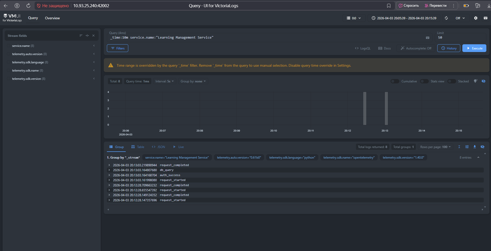

# Lab 8 — Report

Paste your checkpoint evidence below. Add screenshots as image files in the repo and reference them with ``.

## Task 1A — Bare agent

**Q: What is the agentic loop?**
The agentic loop is the fundamental reasoning cycle that autonomous AI agents use to accomplish tasks. It consists of: Perceive → Reason → Act → Reflect, repeated until the task is complete. More sophisticated agents may also include memory, tool selection, and self-correction.

**Q: What labs are available in our LMS?**
I don't have specific information about your LMS in your workspace. To help you find available labs, I need more information about your LMS setup.

## Task 1B — Agent with LMS tools

**Q: What labs are available?**
Here are the available labs:
1. Lab 01 – Products, Architecture & Roles
2. Lab 02 — Run, Fix, and Deploy a Backend Service
3. Lab 03 — Backend API: Explore, Debug, Implement, Deploy
4. Lab 04 — Testing, Front-end, and AI Agents
5. Lab 05 — Data Pipeline and Analytics Dashboard
6. Lab 06 — Build Your Own Agent
7. Lab 07 — Build a Client with an AI Coding Agent
8. lab-08

**Q: Is the LMS backend healthy?**
Yes, the LMS backend is healthy. It currently has 56 items in the system.

## Task 1C — Skill prompt

**Q: Show me the scores**
Agent: Here are the available labs: [list of labs]. Which lab would you like to see the scores for?

## Task 2A — Deployed agent

Startup log excerpt:
🐈 Starting nanobot gateway version 0.1.4.post5 on port 18790...
✓ Channels enabled: webchat
MCP server 'lms': connected, 9 tools registered
Agent loop started

## Task 2B — Web client

**WebSocket test output (real agent response):**
{"type":"text","content":"Here are the available labs:\n\n1. **Lab 01** – Products, Architecture & Roles\n2. **Lab 02** — Run, Fix, and Deploy a Backend Service\n3. **Lab 03** — Backend API: Explore, Debug, Implement, Deploy\n4. **Lab 04** — Testing, Front-end, and AI Agents\n5. **Lab 05** — Data Pipeline and Analytics Dashboard\n6. **Lab 06** — Build Your Own Agent\n7. **Lab 07** — Build a Client with an AI Coding Agent\n8. **Lab 08** — lab-08","format":"markdown"}

Flutter client: The agent responds with the same list of labs when asked "What labs are available?

https://images/flutter_chat.jpg

PASS

## Task 3A — Structured logging

**Happy-path log excerpt:**
backend-1 | 2026-04-03 17:13:03,161 INFO - request_started
backend-1 | 2026-04-03 17:13:03,219 INFO - request_completed
backend-1 | INFO: GET /items/ HTTP/1.1 200 OK

**Error-path log excerpt:**
backend-1 | 2026-04-03 17:24:41,285 INFO - db_query
backend-1 | 2026-04-03 17:24:41,287 ERROR - db_query

(PostgreSQL stopped → items not found)

**VictoriaLogs query screenshot:**

## Task 3B — Traces

Example trace from VictoriaTraces API:

{
    "data": [
        {
            "processes": {
                "p1": {
                    "serviceName": "Learning Management Service",
                    "tags": [
                        {
                            "key": "telemetry.auto.version",
                            "type": "string",
                            "value": "0.61b0"
                        },
                        {
                            "key": "telemetry.sdk.language",
                            "type": "string",
                            "value": "python"
                        },
                        {
                            "key": "telemetry.sdk.name",
                            "type": "string",
                            "value": "opentelemetry"
                        },
                        {
                            "key": "telemetry.sdk.version",
                            "type": "string",
                            "value": "1.40.0"
                        }
                    ]
                }
            },
            "spans": [
                {
                    "duration": 1260,
                    "logs": [],
                    "operationName": "SELECT db-lab-8",
                    "processID": "p1",
                    "references": [
                        {
                            "refType": "CHILD_OF",
                            "spanID": "8fa5cd880d52eda8",
                            "traceID": "d475ad062c8b1aea2d941a8b2f72ddb5"
                        }
                    ],
                    "spanID": "864e4d01eb46e5a0",
                    "startTime": 1775238029924993,
                    "tags": [
                        {
                            "key": "span.kind",
                            "type": "string",
                            "value": "client"
                        },
                        {
                            "key": "otel.scope.name",
                            "type": "string",
                            "value": "opentelemetry.instrumentation.sqlalchemy"
                        },
                        {
                            "key": "otel.scope.version",
                            "type": "string",
                            "value": "0.61b0"
                        },
                        {
                            "key": "db.name",
                            "type": "string",
                            "value": "db-lab-8"
                        },
                        {
                            "key": "db.system",
                            "type": "string",
                            "value": "postgresql"
                        },
                        {
                            "key": "db.user",
                            "type": "string",
                            "value": "postgres"
                        },
                        {
                            "key": "net.peer.name",
                            "type": "string",
                            "value": "postgres"
**Error trace (PostgreSQL stopped, items not found):**

{
    "data": [
        {
            "processes": {
                "p1": {
                    "serviceName": "Learning Management Service",
                    "tags": [
                        {
                            "key": "telemetry.auto.version",
                            "type": "string",
                            "value": "0.61b0"
                        },
                        {
                            "key": "telemetry.sdk.language",
                            "type": "string",
                            "value": "python"
                        },
                        {
                            "key": "telemetry.sdk.name",
                            "type": "string",
                            "value": "opentelemetry"
                        },
                        {
                            "key": "telemetry.sdk.version",
                            "type": "string",
                            "value": "1.40.0"
                        }
                    ]
                }
            },
            "spans": [
                {
                    "duration": 41,
                    "logs": [],
                    "operationName": "GET /items/ http send",
                    "processID": "p1",
                    "references": [
                        {
                            "refType": "CHILD_OF",
                            "spanID": "998da9142e170fff",
                            "traceID": "3b42e7e1fc85b054011c8e3f7623c8f4"
                        }
                    ],
                    "spanID": "2980294f1c359ed2",
                    "startTime": 1775238797919388,
                    "tags": [
                        {
                            "key": "span.kind",
                            "type": "string",
                            "value": "internal"
                        },
                        {
                            "key": "otel.scope.name",
                            "type": "string",
                            "value": "opentelemetry.instrumentation.fastapi"
                        },
                        {
                            "key": "otel.scope.version",
                            "type": "string",
                            "value": "0.61b0"
                        },
                        {
                            "key": "asgi.event.type",
                            "type": "string",
                            "value": "http.response.start"
                        },
                        {
                            "key": "http.status_code",
                            "type": "string",
                            "value": "404"
                        }
                    ],
                    "traceID": "3b42e7e1fc85b054011c8e3f7623c8f4",
                    "warnings": null
                },
                {
                    "duration": 20,
                    "logs": [],
                    "operationName": "GET /items/ http send",
                    "processID": "p1",
                    "references": [
                        {
                            "refType": "CHILD_OF",
                            "spanID": "998da9142e170fff",
                            "traceID": "3b42e7e1fc85b054011c8e3f7623c8f4"
                        }
                    ],
                    "spanID": "aebab2b265954266",
                    "startTime": 1775238797919884,
                    "tags": [
                        {
                            "key": "span.kind",
                            "type": "string",
                            "value": "internal"
                        },
                        {
                            "key": "otel.scope.name",
                            "type": "string",
                            "value": "opentelemetry.instrumentation.fastapi"
                        },

## Task 3C — Observability MCP tools

<!-- Paste agent responses to "any errors in the last hour?" under normal and failure conditions -->

## Task 4A — Multi-step investigation

<!-- Paste the agent's response to "What went wrong?" showing chained log + trace investigation -->

## Task 4B — Proactive health check

<!-- Screenshot or transcript of the proactive health report that appears in the Flutter chat -->

## Task 4C — Bug fix and recovery

<!-- 1. Root cause identified
     2. Code fix (diff or description)
     3. Post-fix response to "What went wrong?" showing the real underlying failure
     4. Healthy follow-up report or transcript after recovery -->
